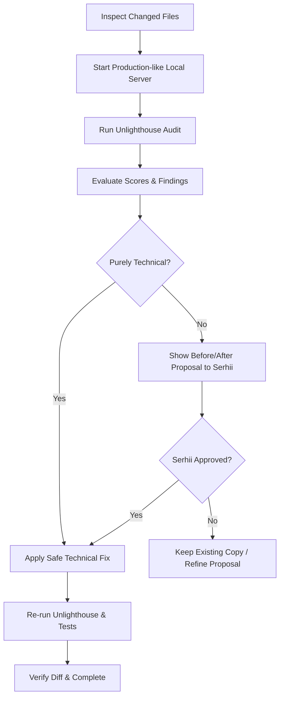

# SEO Audit & Technical SEO Workflow

This workflow defines the quality and search-engine indexability standards for Serhii Orlenko's portfolio. It covers crawlability, semantic HTML, metadata, Core Web Vitals, image SEO, and search-engine discoverability.

## Core Rules & Guardrails
- **Grounding**: The professional identity is strictly **Serhii Orlenko — UI/UX Designer | Product Design • Web & Mobile**. Do not infer seniority or unauthorized claims.
- **Copy Protection**: Do not automatically alter public copy, visible headings, job titles, or project descriptions without Serhii's explicit approval.
- **Scope**: Keep audits and tooling within this repository. No separate project or global dependencies.

## Definition of Done for Public Pages
A public-facing page or update is NOT complete until:
1. **Crawlability**: It can be crawled and discovered by search bots if intended (HTTP 200, valid robots directives, present in `sitemap.xml`).
2. **Metadata**: Contains valid, unique `<title>`, `<meta name="description">`, canonical URL, and Open Graph tags (`og:title`, `og:description`, `og:image`, `og:url`).
3. **Semantic Hierarchy**: Exactly one logical `<h1>`, hierarchical subheadings (`<h2>`, `<h3>`), semantic landmarks (`<header>`, `<nav>`, `<main>`, `<article>`, `<footer>`), and valid alt tags on non-decorative images.
4. **Performance & CWV**: Passes local Lighthouse/Unlighthouse baseline budgets (SEO >= 90, Accessibility >= 90, Best Practices >= 85, Performance >= 65).
5. **No Regressions**: Responsive layouts remain verified across breakpoints (referencing `responsive-ui-testing` if needed).
6. **Approval**: Any copy-sensitive change (titles, meta descriptions, schema text) is submitted to Serhii with before/after rationale and approved before committing.

## Step-by-Step Audit Workflow



### 1. Build & Serve
Serve the static portfolio on the standard test port (4173):
```bash
python3 -m http.server 4173
```

### 2. Run Site-Wide Audit
Execute the standard Unlighthouse audit:
```bash
npm run seo:audit
```
Or for specific viewport audits:
- Mobile: `npm run seo:audit:mobile`
- Desktop: `npm run seo:audit:desktop`
- Open full visual report: `npm run seo:report`

### 3. Check Technical SEO Checklist
- [ ] **Robots**: `robots.txt` exists at root, allows crawling, and references sitemap.
- [ ] **Sitemap**: `sitemap.xml` lists only canonical, indexable public URLs.
- [ ] **Canonicals**: Each indexable page has a valid absolute canonical tag.
- [ ] **Redirects / Deprecated Pages**: Utility redirects (`about.html`, `contact-me.html`) have `noindex, follow` and point canonical to the parent target.
- [ ] **Images**: Width and height attributes declared; proper responsive `srcset` and `sizes`; non-empty meaningful alt text for content images; empty `alt=""` for purely decorative elements.
- [ ] **Structured Data**: JSON-LD schema (e.g. `Person`, `WebSite`) is valid, mirrors on-page reality, and contains no fictitious claims.

### 4. Search Console & Post-Deployment Checklist
When deploying to the live domain (`grifano.com`):
1. Verify domain ownership in Google Search Console (DNS TXT record or HTML verification file).
2. Submit `https://www.grifano.com/sitemap.xml`.
3. Inspect the home URL (`/`) with the URL Inspection tool to confirm mobile crawlability and index status.
4. Monitor Search Console for Core Web Vitals, schema parsing, and indexing coverage.
